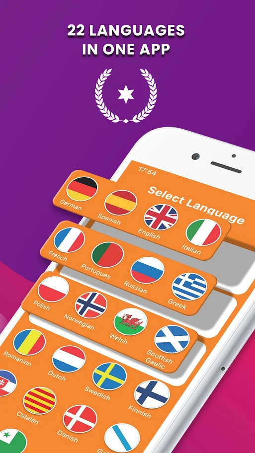

# Learnbot app project
The Learning verbs app about 22 countries

This app use **Laravel** as Backend and **Flutter** as Mobile development.


## Getting Started
You can directly install the apk file (present in apk folder) on any android device

## App Screens
<p>

</p>
<p>
</p>
<p>
</p>
<p>
</p>


#### Building from source

If you do not have the Flutter SDK installed, follow the instructions from the
Flutter site [here](https://flutter.dev/docs/get-started/install).


Get the dependencies by running this command inside the project directory:

```
flutter pub get
```

Then either run this command to run the app in device:

```
flutter run
```